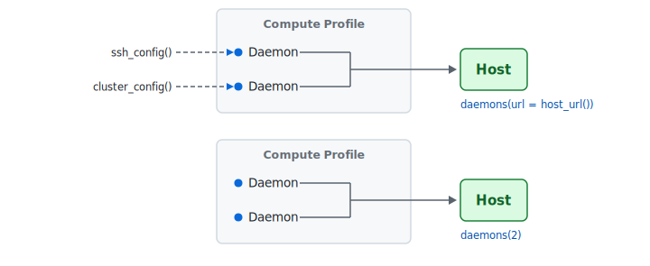

<!-- README.md is generated from README.Rmd. Please edit that file -->

```{r}
#| include: false
knitr::opts_chunk$set(
  collapse = TRUE,
  comment = "#>",
  fig.path = "man/figures/README-",
  out.width = "100%"
)
```

# mirai <a href="https://mirai.r-lib.org/" alt="mirai"></a>

<!-- badges: start -->
[](https://CRAN.R-project.org/package=mirai)
[](https://r-lib.r-universe.dev/mirai)
[](https://github.com/r-lib/mirai/actions/workflows/R-CMD-check.yaml)
[](https://app.codecov.io/gh/r-lib/mirai)
<!-- badges: end -->

### ミライ

Minimalist Async Evaluation Framework for R
<br /><br />

→ Event-driven core with microsecond messaging

→ Scale from laptop to HPC and cloud — add or remove compute on the fly

→ Built for production — bounded queues, cancellation, distributed tracing

<br />
[](https://deepwiki.com/r-lib/mirai)
<br />

### Installation

```{r}
#| label: cran
#| eval: false
install.packages("mirai")
```

### Quick Start

```{r}
#| label: quick-start
library(mirai)
daemons(4)

# Async — non-blocking, event-driven
m <- mirai({ Sys.sleep(1); mean(rnorm(1e6)) })
unresolved(m)
m[]

# Parallel map with progress and early-stop on error
mirai_map(1:9, \(x) { Sys.sleep(0.1); x^2 })[.progress, .flat]

daemons(0)
```

### Architecture

`mirai()` sends tasks to *daemons* — persistent R worker processes. The host listens at a URL; daemons dial in and pull work via an in-process *dispatcher thread* that handles FIFO scheduling, cancellation, and bounded queues. Add or remove daemons at any time, and direct tasks to different *compute profiles* (CPU pool, GPU pool, remote cluster) from the same session.



Round-trip latency stays in the microseconds:

```{r}
#| label: bench
daemons(1)
bench::mark(mirai(1)[])
daemons(0)
```

### Deploy

| Where | Setup |
| --- | --- |
| Local machine | `daemons(n)` |
| SSH (direct or tunnelled) | `ssh_config()` |
| HPC scheduler — Slurm, SGE, Torque/PBS, LSF | `cluster_config()` |
| HTTP API — Posit Workbench, custom | `http_config()` |
| Anywhere else | `remote_config()` |

```{r}
#| label: deploy-example
#| eval: false
daemons(
  n = 4,
  url = host_url(tls = TRUE),
  remote = cluster_config(options = "#SBATCH --mem=10G")
)
```

See the [reference vignette](https://mirai.r-lib.org/articles/v01-reference.html) for the full deployment guide.

### What's inside

- **Async** — `mirai()`, `mirai_map()`, `everywhere()`, `race_mirai()`, `try_mirai()`
- **Collection** — `m[]`, `collect_mirai()`, `call_mirai()`, `.flat`, `.progress`, `.stop`
- **[Promises](https://mirai.r-lib.org/articles/v02-promises.html)** — `as.promise()` for `mirai` and `mirai_map`; event-driven Shiny ExtendedTask
- **Cancellation & timeouts** — `stop_mirai()`, `.timeout`, `.stop`
- **Backpressure** — `daemons(memory = …)` capacity, peak watermark via `status()$memory`, non-blocking `try_mirai()`
- **[Serialization](https://mirai.r-lib.org/articles/v03-serialization.html)** — `serial_config()` for torch, Arrow, polars, ADBC; `mori::share()` for local shared memory
- **Reproducibility** — L'Ecuyer-CMRG streams; `daemons(seed = …)` for deterministic parallel RNG
- **[Observability](https://mirai.r-lib.org/articles/v05-opentelemetry.html)** — `info()`, `status()`, OpenTelemetry spans via `otel`
- **Compute profiles** — independent daemon pools, `with_daemons()`, `local_daemons()`
- **[R parallel cluster](https://mirai.r-lib.org/articles/v04-parallel.html)** — `parallel::makeCluster(type = "MIRAI")` (R ≥ 4.5)

### Across the R stack

<p align="center"><a href="https://mirai.r-lib.org/articles/v04-parallel.html"></a>&nbsp;&nbsp;&nbsp;<a href="https://mirai.r-lib.org/articles/v02-promises.html"></a>&nbsp;&nbsp;&nbsp;<a href="https://mirai.r-lib.org/articles/v02-promises.html"></a>&nbsp;&nbsp;&nbsp;<a href="https://www.tidyverse.org/"></a>&nbsp;&nbsp;&nbsp;<a href="https://purrr.tidyverse.org"></a>&nbsp;&nbsp;&nbsp;<a href="https://www.tidymodels.org/"></a>&nbsp;&nbsp;&nbsp;<a href="https://tune.tidymodels.org/"></a>&nbsp;&nbsp;&nbsp;<a href="https://ragnar.tidyverse.org/"></a>&nbsp;&nbsp;&nbsp;<a href="https://docs.ropensci.org/targets/"></a>&nbsp;&nbsp;&nbsp;<a href="https://wlandau.github.io/crew/"></a>&nbsp;&nbsp;&nbsp;<a href="https://arrow.apache.org/docs/r/"></a>&nbsp;&nbsp;&nbsp;<a href="https://torch.mlverse.org/"></a></p>

mirai has become the shared async layer for the R ecosystem. It's the [recommended](https://rstudio.github.io/promises/articles/promises_04_mirai.html) async backend for Shiny and the only one for plumber2 — if you're building APIs with plumber2's `@async` tag, you're already using mirai. It's the parallel engine behind `purrr::in_parallel()`, drives `targets` pipelines through `crew`, and is the first [official alternative communications backend](https://stat.ethz.ch/R-manual/R-devel/library/parallel/html/makeCluster.html) for R's `parallel`.

### Acknowledgements

[Will Landau](https://github.com/wlandau/) for being instrumental in shaping development of the package, from initiating the original request for persistent daemons, through to orchestrating robustness testing for the high performance computing requirements of crew and targets.

[Joe Cheng](https://github.com/jcheng5/) for integrating the 'promises' method to work seamlessly within Shiny, and prototyping event-driven promises.

[Luke Tierney](https://github.com/ltierney/) of R Core, for discussion on L'Ecuyer-CMRG streams to ensure statistical independence in parallel processing, and reviewing mirai's implementation as the first 'alternative communications backend for R'.

[Travers Ching](https://github.com/traversc) for a novel idea in extending the original custom serialization support in the package.

[Hadley Wickham](https://github.com/hadley), [Henrik Bengtsson](https://github.com/HenrikBengtsson/), [Daniel Falbel](https://github.com/dfalbel/), and [Kirill Müller](https://github.com/krlmlr/) for many deep insights and discussions.

### Links

[mirai](https://mirai.r-lib.org/) | 
[nanonext](https://nanonext.r-lib.org/) | 
[CRAN HPC Task View](https://cran.r-project.org/view=HighPerformanceComputing)

AI coding agents: the `r-lib` agent skill from the [`posit-dev-skills`](https://github.com/posit-dev/skills) plugin provides mirai-specific guidance.

--

Please note that this project is released with a [Contributor Code of Conduct](https://mirai.r-lib.org/CODE_OF_CONDUCT.html). By participating in this project you agree to abide by its terms.
