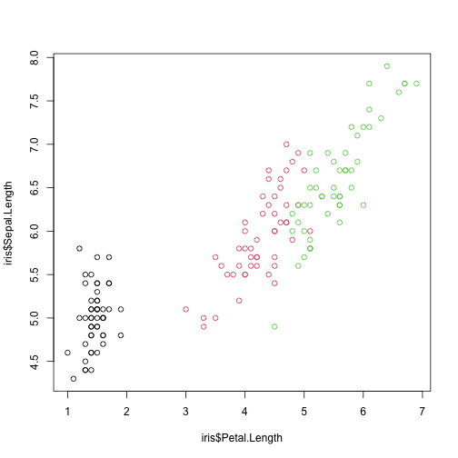

### 1. Overview

`register_render()` lets selected R code chunks of a knitr, R Markdown, Quarto or litedown document evaluate on a mirai daemon instead of in the host session.

This is useful when a document mixes lightweight narrative code with chunks that need more resources: a GPU machine, a high-memory node, or simply a separate process that keeps the host session responsive.

Chunk routing is controlled by a single chunk option:

  + `#| compute: gpu` evaluates the chunk on the `"gpu"` compute profile
  + `#| compute: true` evaluates the chunk on the `"default"` profile
  + an untagged chunk evaluates in the host session, unchanged

### 2. The Setup Chunk

Everything below goes in the document's setup chunk: set up one daemon per compute profile used for chunk routing, with `cleanup = FALSE`, then call `register_render()` once to install the hook with knitr and/or litedown, whichever is available:


``` r
library(mirai)

daemons(1, cleanup = FALSE)
daemons(1, .compute = "gpu", cleanup = FALSE)

register_render()
```

`cleanup = FALSE` preserves the daemon's global environment between chunks, so objects created in one chunk are visible in later chunks on the same profile — mirroring a normal rendering session. A single daemon ensures those chunks all evaluate in the same process.

For remote execution, supply `url` and `remote` to `daemons()` in the usual way, e.g. `daemons(1, url = host_url(), remote = remote_config(), .compute = "gpu", cleanup = FALSE)`. Routed chunks then run on the remote machine, and figures are transferred back to the host automatically.

### 3. Tag Chunks with `compute`

Add `#| compute: <profile>` to any chunk that should run on a daemon. This chunk runs on the `"gpu"` profile, in a separate process from the host:


``` r
#| compute: gpu
Sys.getpid()
#> [1] 56527
```

Untagged chunks continue to evaluate in the host session — comparing the process ID below with the one above confirms the routed chunk ran in a different process:


``` r
Sys.getpid()
#> [1] 56496
```

Note that a routed chunk cannot see objects in the host session: there is no closure capture from the host, so each routed chunk is self-contained, with state shared only between chunks on the same profile (see below).

### 4. State Persists Between Chunks on a Profile

Because each routing profile uses a single daemon with `cleanup = FALSE`, objects created by one routed chunk are available to later chunks on the same profile:


``` r
#| compute: gpu
model <- lm(Sepal.Length ~ Petal.Length, data = iris)
coef(model)
#>  (Intercept) Petal.Length 
#>    4.3066034    0.4089223
```

``` r
#| compute: gpu
summary(model)$r.squared
#> [1] 0.7599546
```

The host session and other profiles remain isolated — `model` does not exist in the host session:


``` r
exists("model")
#> [1] FALSE
```

### 5. Figures

Figures produced by routed chunks work with local and remote daemons alike. Under knitr they are recorded on the daemon and replayed on the host device; under litedown they are recorded to files on the daemon and transferred back to the document's figure directory. No extra chunk options are needed:


``` r
#| compute: gpu
plot(iris$Petal.Length, iris$Sepal.Length, col = iris$Species)
```

<div class="figure">

<p class="caption">plot of chunk figure</p>
</div>

### 6. Requirements and Notes

  + Daemons of a routed profile need the relevant rendering packages installed: knitr and evaluate for knitr documents, or xfun for litedown documents. knitr is loaded on the daemons automatically the first time a chunk is routed there.
  + Inline R code always evaluates in the host session.
  + Calling `register_render()` more than once is safe. If daemons are reset with `daemons(0)` mid-render, call `register_render()` again so the replacement daemons are prepared.
  + Chunks on a profile evaluate sequentially in one process; this feature routes whole chunks rather than parallelizing within a chunk. For parallel workloads inside a chunk, use `mirai()` or `mirai_map()` as usual.


